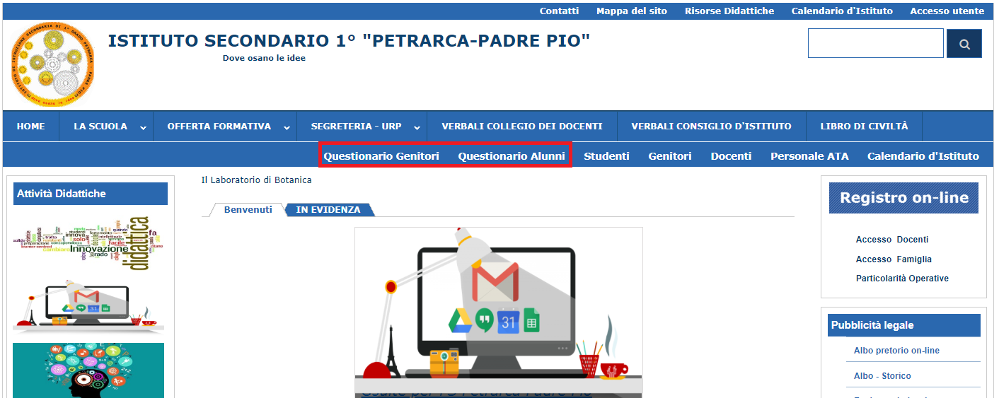

OGGETTO: Attività di Autovalutazione d’Istituto – Questionari Customer Satisfaction genitori e alunni.-

 

Al fine di raccogliere informazioni che ci permettano una valutazione più precisa e articolata del Piano dell’Offerta Formativa della nostra istituzione, e migliorare l’efficacia dell’azione didattico-educativa, si invitano famiglie e alunni alla compilazione dei questionari di gradimento e ad esprimere eventuali suggerimenti e/o osservazioni, così da poter predisporre per l’a.s. 2019/20 un Piano di miglioramento il più possibile rispondente al fabbisogno culturale-formativo degli stakeholder.

 I questionari sono anonimi e compilabili on line sul nostro sito web, semplicemente selezionando il link \ |STYLE0|\  o \ |STYLE1|\ . Questi ultimi sono presenti nella parte alta della pagina iniziale del sito, come evidenziato nell’immagine seguente:

\ |IMG1|\ 

La compilazione va completata entro il 30 maggio.

La F.S., prof.ssa Diciolla Maria Antonella, si rende disponibile a supportare le famiglie eventualmente in difficoltà nella compilazione, ogni lunedì dalle ore 10,30 alle ore 11,25  presso il plesso Petrarca.

Si confida nella più ampia collaborazione dei coordinatori di classe che, per sostenere il processo di autovalutazione e sottolinearne l’importanza, solleciteranno le famiglie e gli studenti alla compilazione dei suddetti questionari tramite avviso scritto sul diario. 

.. bottom of content

.. |STYLE0| replace:: *Questionario Alunni*

.. |STYLE1| replace:: *Questionario Genitori*

